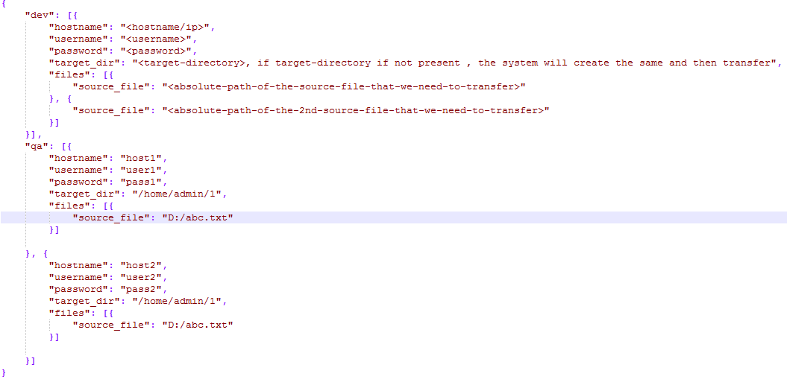

# FileTransferUtility
Utility that transfers file from your local machine to remote machine using SFTP

<b>Project : FileTransferUtility</b> 

<b>Motivation:</b>  
The idea behind this project was to enable rapid deployment of binaries in Development/QA Environments.  
The solution uses SFTP protocol to transfer files. 

<b>Technologies Used:</b> 
Java 
Apache Maven 
Jsch library 

<b>Installation:</b> 
The project is a Maven project , hence the user would require maven binaries to build the solution. (Maven 3.0+) 

<b>How To Use:</b> 
Once the project is build, you will find following jars in the target folder : 
a) FileTransferUtility.jar (Source Code Jar)  
b) FileTransferUtility-jar-with-dependencies.jar (Executable Jar) 

i) Navigate to src/main/resources folder inside the project , there will be a file named config.json present in the folder.
Copy <b>config.json</b> , <b>FileTransferUtility-jar-with-dependencies.jar</b> and place the same in a seperate folder (Ex: temp).
 

<ul>
<li>temp -> config.json</li>
<li>temp -> FileTransferUtility-jar-with-dependencies.jar</li>
</ul>
 

ii) Create a folder with name conf inside the seperate folder (temp) and place config.json file inside that folder. 
<ul>
<li>temp -> <b>conf</b>->config.json</li>
<li>temp -> FileTransferUtility-jar-with-dependencies.jar</li>
</ul>

 
iii) In order to initiate the job : 
<b>java -jar FileTransferUtility-jar-with-dependencies.jar [qa/dev] </b> 
 
iv) Based on the configuration set in the config.json file, qa or dev section would get picked up and processed. 

 
<b>Configure config.json :</b> 

